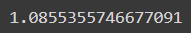
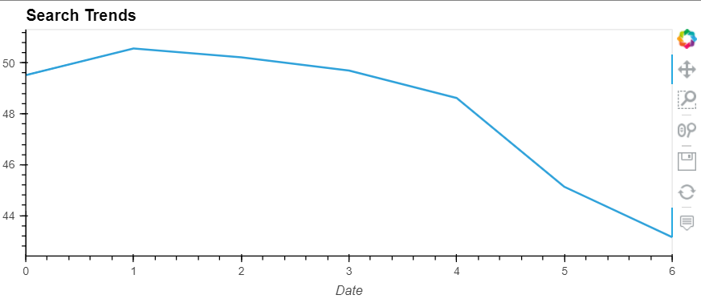
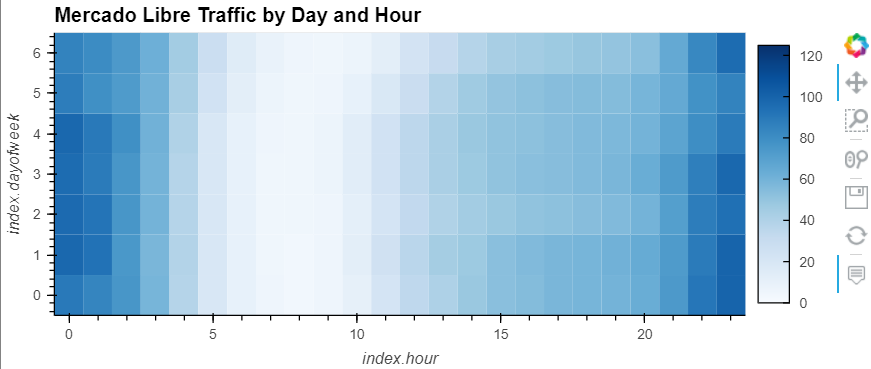
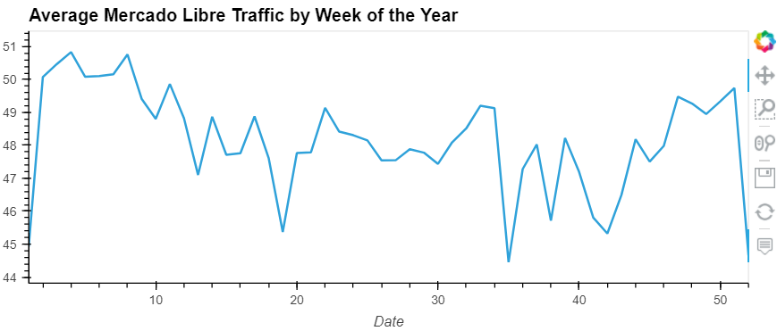
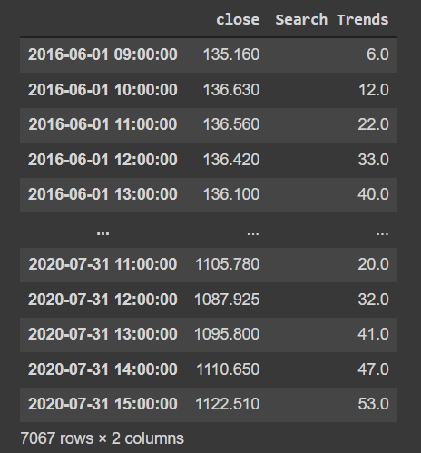
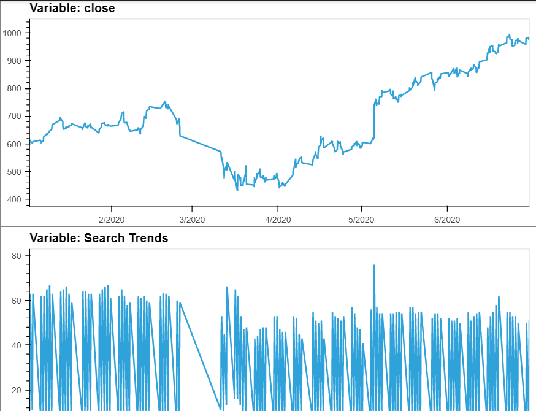

# Mercado_Libre_Future
Does ability to predict search traffic translate into the ability to successfully trade the stock?

---

## Technologies

This project leverages python 3.7 with the following packages:

**[IPython.display Library](https://ipython.readthedocs.io/en/stable/api/generated/IPython.display.html)** - Public API for display tools in IPython.<br>

**[PyStan Library](https://pystan.readthedocs.io/en/latest/)** - Stan® is a state-of-the-art platform for statistical modeling and high-performance statistical computation.<br>

**[FB Prophet Library](https://pypi.org/project/fbprophet/)** - Prophet is a procedure for forecasting time series data based on an additive model where non-linear trends are fit with yearly, weekly, and daily seasonality, plus holiday effects.<br>

**[HVPlot Library](https://hvplot.holoviz.org/)** - A high-level plotting API for the PyData ecosystem built on HoloViews.<br>

**[HoloViews Library](https://pypi.org/project/holoviews/)** - HoloViews is an open-source Python library designed to make data analysis and visualization seamless and simple.<br>

**[Pandas Library](https://pandas.pydata.org/)** - pandas is a fast, powerful, flexible and easy to use open source data analysis and manipulation tool.<br>

**[Datetime Library](https://docs.python.org/3/library/datetime.html)** - The datetime module supplies classes for manipulating dates and times.<br>

**[Matplotlib Library](https://matplotlib.org/)** - Matplotlib is a comprehensive library for creating static, animated, and interactive visualizations in Python.<br>

---

## Installation and Usage Guide

Before running the application first install the following dependencies:

In this application, you’ll use charts with hvPlot and use the Facebook Prophet library (Links to an external site.) to analyze time series data.

The Facebook Prophet library can be difficult to install on some machines, so for this application you'll also get aquainted with Google Colab - an IDE that allows you to run Jupyter Notebooks in the cloud. Before beginning running the application, take a moment to follow the directions on how to open a notebook in Google Colab, install the necessary libraries and import data.

Step 1: Open a new notebook in Google Colab: https://colab.research.google.com/<br>

Step 2: Install the reqired libraries:

```python
from IPython.display import clear_output
try:
  !pip install pystan
  !pip install fbprophet
  !pip install hvplot
  !pip install holoviews
except:
  print("Error installing libraries")
finally:
  clear_output()
  print('Libraries successfully installed')
```

Step 3: Import the required libraries:

```python
import pandas as pd
import holoviews as hv
from fbprophet import Prophet
import hvplot.pandas
import datetime as dt
%matplotlib inline
```

Step 4: Read the search data into a DataFrame, and then slice the data to just the month of May 2020. Use hvPlot to visualize the results (May 2020):


Step 5: Compare the seach traffic for the month of May 2020 to the overall monthly median value
Once you run the cell with the calculation, for Mercado Libre it resulted in:



This means that our Mercado Libre traffic for the month of May 2020 was 9% greater than what the monthly traffic average is for the rest of the months. 

Step 6: Group the hourly search data to plot the average traffic by the day of the week (for example, Monday vs. Friday):



Here we can tell that the day, numbered 1, with the highest average traffic is Tuesday. 

Step 7: Use hvPlot to visualize the hour of the day and day of week search traffic as a heatmap:



In this heatmap we can see another trend. While the line plot lets us know that Tuesdays are the days with the most traffic, every day has a pick up in its traffic from approx. 9pm to about 2am.

Step 8: Group the hourly search data to plot (use hvPlot) the average traffic by the week of the year:



As we can tell in this visualization, the best period of the year for traffic on Mercado Libre seems to be the first 10 weeks of the year. 

Step 9: Concatenate the df_mercado_stock DataFrame with the df_mercado_trends DataFrame



Notice that both the trend and closing dataframes are in one combined dataframe. 

Step 10: Use hvPlot to visualize the close and Search Trends data:



Stacking these plots will give us a great idea of the relationship between Google Search Trends and Closing Stock Prices. 

Step 11: 